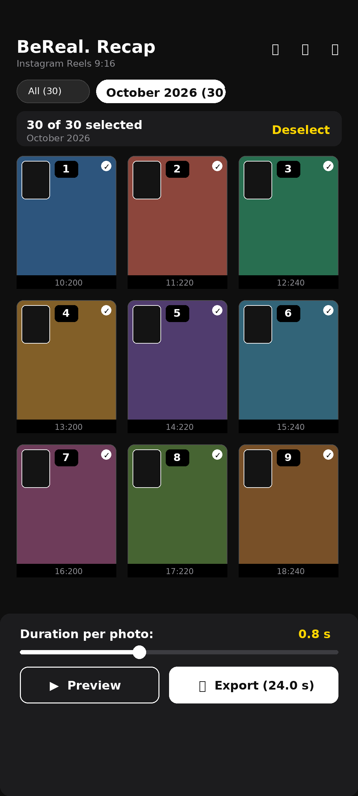
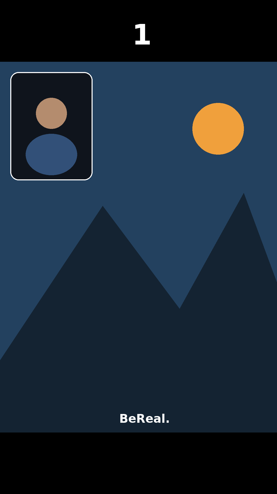

# BeReal Recap 📱🎬

[](https://github.com/lagosproject/BeRealRecop/actions/workflows/build.yml)
[-brightgreen.svg)](https://developer.android.com)
[](https://kotlinlang.org)
[](https://opensource.org/licenses/MIT)

> **Automated monthly BeReal recap videos optimized for Instagram Reels & Stories.**  
> *Vídeos recopilatorios mensuales automáticos de BeReal optimizados para Instagram Reels.*  
> *Vidéos récapitulatives mensuelles BeReal optimisées pour Instagram Reels.*

---

## 🌍 Languages / Idiomas / Langues
- 🇬🇧 [English](#english)
- 🇪🇸 [Español](#español)
- 🇫🇷 [Français](#français)

---

<a name="english"></a>
## 🇬🇧 English

### ✨ Features
- **Automatic Filename Recognition**: Parses the native BeReal export nomenclature (`bereal-{day}_{month}_{year}_{hour}_{minute}_{second}.jpeg`) and chronologically orders all photos by day and time.
- **Consecutive Bonus BeReals**: Days with multiple BeReals appear consecutively with the same day number.
- **Instagram Reels Optimization (1080x1920, 9:16)**: Centers the native 3:4 photo on a solid black vertical canvas with clean top/bottom margins.
- **Top Day Badge**: Only the day number (`1`, `2`, ..., `31`), bold, white, centered in the top band for maximum clarity.
- **Interactive Live Preview**: Full-screen 60 FPS slideshow simulator with live playback speed slider (`0.2s` - `2.5s`), pause/resume, and skip buttons.
- **Automatic Month Grouping**: Filters photos by month (`September 2026`, `October 2026`) so upcoming months never mix.
- **Hardware-Accelerated Video Rendering**: `MediaCodec` + `OpenGL ES` H.264 MP4 export in just a few seconds.
- **Silent Audio Track**: Ready to add trending music directly in the Instagram Reels music editor.
- **Multilingual UI**: English, Spanish, and French.

### 📸 Screenshots
<p align="center">
  
  &nbsp;&nbsp;&nbsp;&nbsp;
  
</p>

### 📥 Download APK
1. Go to the [Releases](https://github.com/lagosproject/BeRealRecop/releases) page.
2. Download `app-debug.apk` and install it on your Android phone.
3. Or download the latest build from the [GitHub Actions Artifacts](https://github.com/lagosproject/BeRealRecop/actions).

---

<a name="español"></a>
## 🇪🇸 Español

### ✨ Características
- **Reconocimiento Automático de Nomenclatura**: Detecta el formato nativo de descarga de BeReal (`bereal-{dia}_{mes}_{año}_{hora}_{minuto}_{segundo}.jpeg`) y ordena cronológicamente todas las fotos por día y hora.
- **BeReals Múltiples Consecutivos**: Si un día tiene varios BeReals, se muestran de forma consecutiva con el mismo número de día.
- **Optimizado para Instagram Reels (1080x1920, 9:16)**: Centra la foto nativa 3:4 en un lienzo vertical con franjas en negro sólido arriba y abajo.
- **Número de Día Superior**: Solo el número del día (`1`, `2`, ..., `31`), en blanco bold, centrado en la franja superior.
- **Vista Previa en Vivo**: Reproductor interactivo a 60 FPS con ajuste de velocidad en tiempo real (`0.2 s` a `2.5 s`), pausa y salto de fotos.
- **Agrupación Automática por Mes**: Pestañas automáticas (`Septiembre 2026`, `Octubre 2026`) para que cada mes se mantenga independiente.
- **Codificación por Hardware Ultra Rápida**: `MediaCodec` + `OpenGL ES` H.264 MP4 en cuestión de segundos.
- **Pista de Audio Silenciosa**: Diseñado para añadir la música en tendencia directamente desde el editor de Instagram.
- **Totalmente Internacionalizado**: Español, Inglés y Francés.

---

<a name="français"></a>
## 🇫🇷 Français

### ✨ Fonctionnalités
- **Reconnaissance automatique des noms de fichiers** : Détecte le format d'exportation BeReal (`bereal-{jour}_{mois}_{année}_{heure}_{minute}_{seconde}.jpeg`) et trie chronologiquement toutes les photos.
- **BeReals multiples consécutifs** : Les jours avec plusieurs BeReals s'affichent consécutivement avec le même numéro de jour.
- **Optimisé pour Instagram Reels (1080x1920, 9:16)** : Centre la photo 3:4 sur un canevas vertical avec des bandes noir solide en haut et en bas.
- **Numéro du jour en haut** : Affiche uniquement le numéro du jour (`1`, `2`, ..., `31`), en blanc gras centré dans la bande supérieure.
- **Aperçu interactif en direct** : Simulateur plein écran à 60 FPS avec curseur de vitesse de lecture en temps réel (`0.2 s` - `2.5 s`).
- **Filtrage automatique par mois** : Onglets par mois (`Septembre 2026`, `Octobre 2026`) pour séparer chaque mois.
- **Rendu vidéo accéléré par matériel** : Exportation MP4 H.264 ultra rapide avec `MediaCodec` et `OpenGL ES`.
- **Piste audio silencieuse** : Prêt pour ajouter la musique tendance directement dans Instagram Reels.

---

## 🛠️ Building from Source

### Prerequisites
- JDK 21
- Android SDK (compileSdk 34, minSdk 26)

```bash
# Clone the repository
git clone https://github.com/lagosproject/BeRealRecop.git
cd BeRealRecop

# Run unit tests
./gradlew testDebugUnitTest

# Assemble Debug APK
./gradlew assembleDebug

# Output APK location:
# app/build/outputs/apk/debug/app-debug.apk
```

---

## 📄 License
This project is licensed under the [MIT License](LICENSE).
